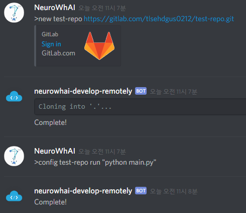
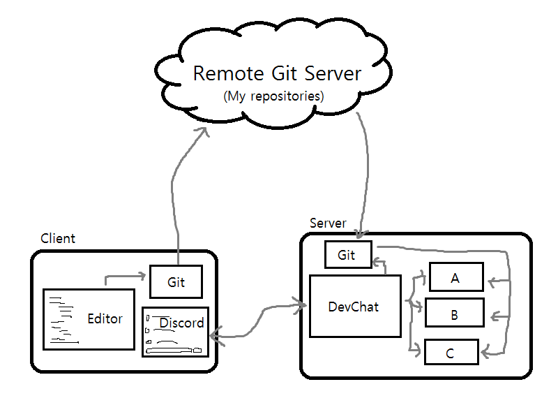

# Dev Chat
  
Develop remotely with Discord bot.

## Screenshots

Register/Config a project.  

Run the project and Interact with standard streams.  

## How it works?

## Why?

왜냐하면 나는 군 복무 중이고 [사지방](https://namu.wiki/w/사이버%20지식%20정보방)에서 개발하는 것은 :shit: 같은 일이기 때문이다.  
만약 당신이 사지방에서 코딩을 할 수밖에 없는 상황이 아니거나 오래 걸리는 개발 환경설정이 필요 없거나 개인 서버가 없거나 더 좋은 방법을 사용하고 있다면 이 프로젝트는 도움이 안 된다.  
~~부럽다.~~
